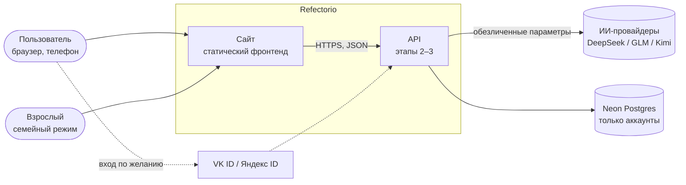
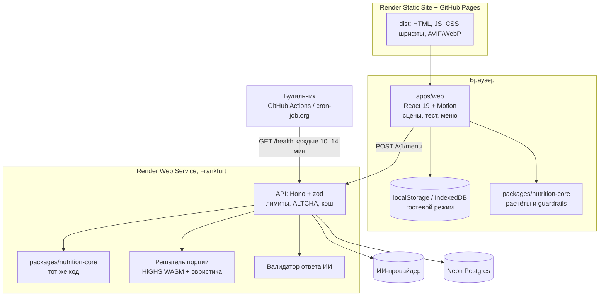
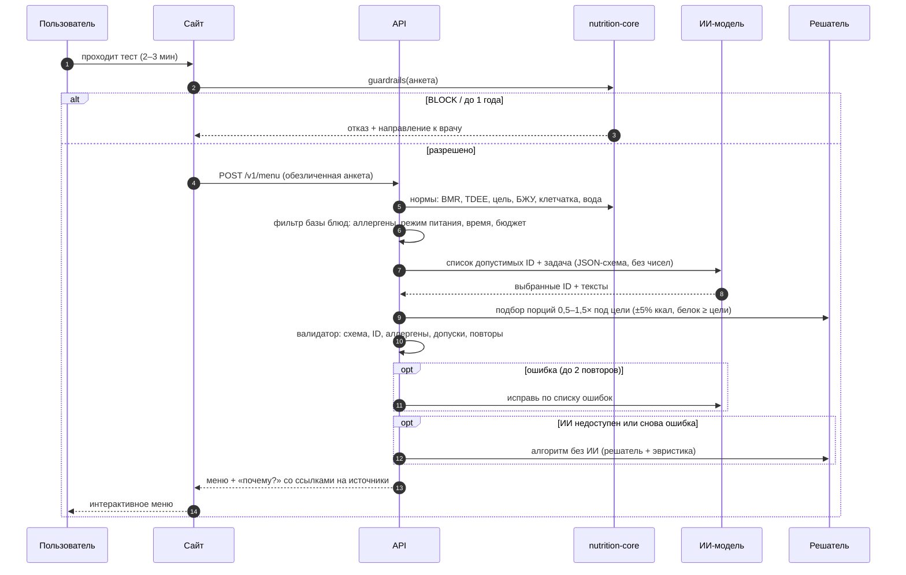

# Архитектура Refectorio

Решения — в `docs/adr/` (0001–0007). Черновики этапов 2–3: модель данных — `docs/drafts/data-model.md`,
контракт API — `docs/drafts/openapi.yaml`.

## 1. Контекст системы

## 2. Контейнеры

Один и тот же пакет `nutrition-core` работает и в браузере (живой расчёт в тесте), и на сервере (меню) — числа одинаковы везде.

## 3. Поток генерации меню

